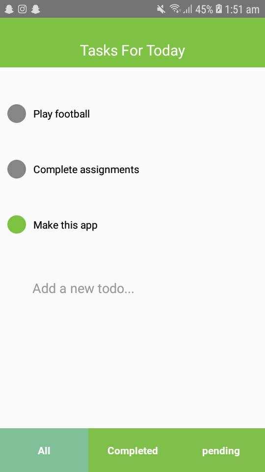

# To-Do-app-with-redux
I developed this app in order to get hands on practice with Redux.

<h3>How to Run ?</h3>

1. react-native init todolist 
2. npm install redux react-redux 
4. copy index.js and replace the one inside your project  
4. Copy the 'src' folder and paste the folder inside your project 
5. run react-native run-android 

<h4>Note: I did not use any form of navigation for this app.</h4>

